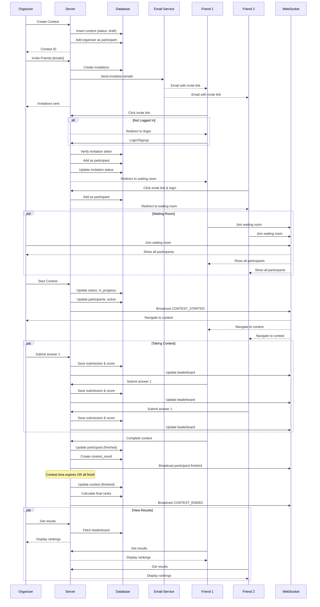
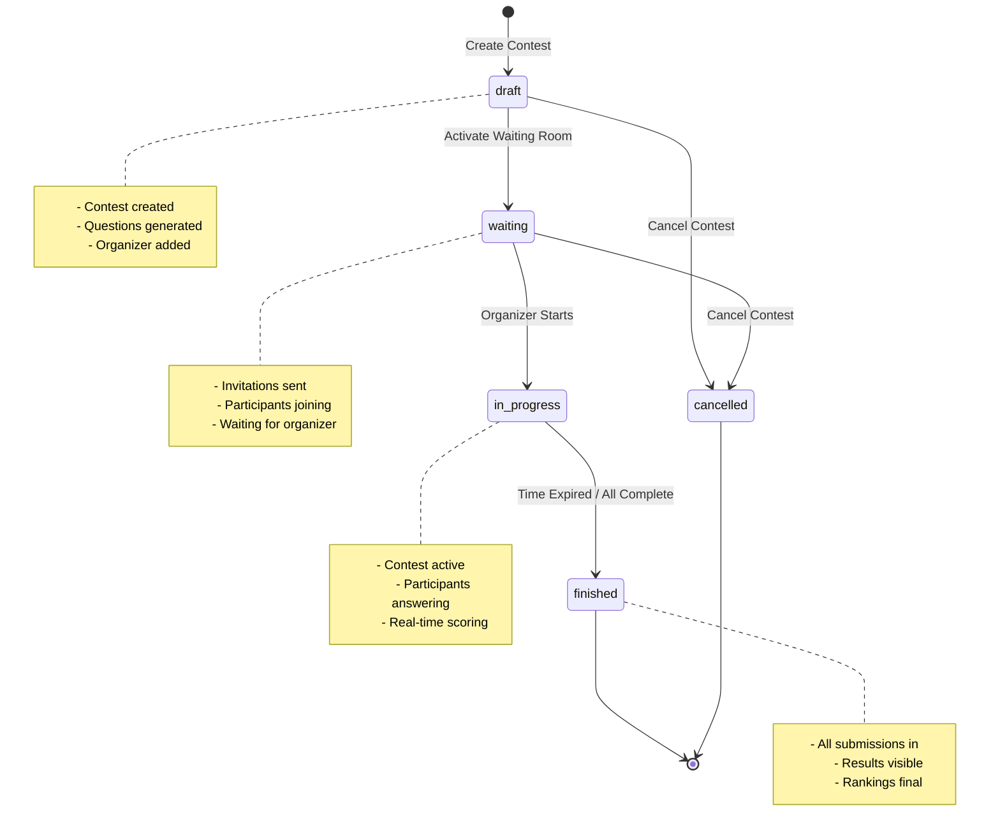
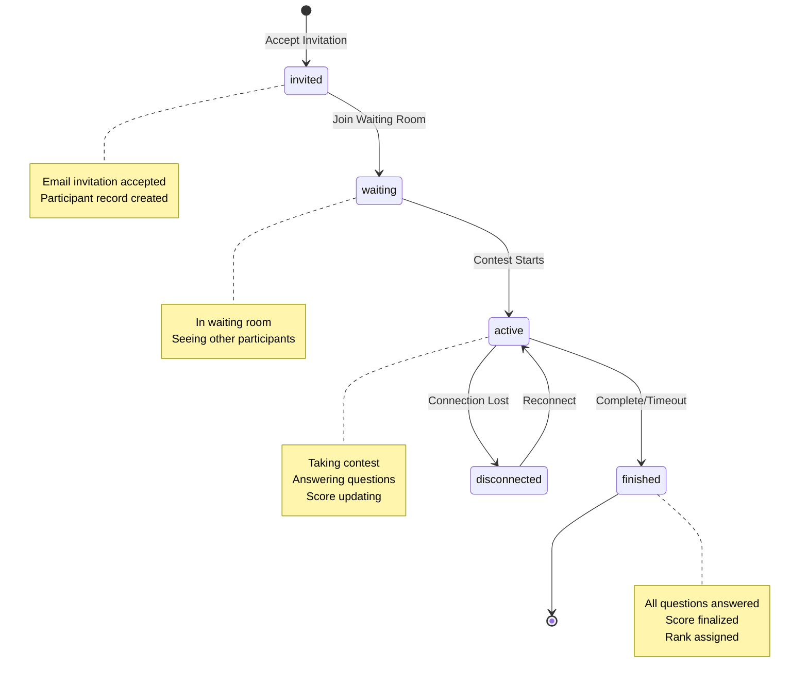

# Contest System - Complete Flow Documentation

## Overview
The Momentum Contest system allows users to create private contests, invite friends via email, and compete in real-time quiz battles with a waiting room system.

## System Flow Diagram



## State Machine Diagram



## Participant Status Flow



## Architecture

### Database Schema
The contest system uses the following tables in the Drizzle schema:

1. **contest** - Contest metadata and configuration
2. **contest_invitation** - Email invitations with verification tokens
3. **contest_participant** - Users participating in contests
4. **problem_set** (questions) - Question bank
5. **contest_question** - Questions assigned to specific contests
6. **contest_submission** - Individual answer submissions
7. **player_answer** - Answer tracking for WebSocket compatibility
8. **contest_result** - Final rankings and scores

### Contest States
- **draft** - Contest created but not started
- **waiting** - Waiting room active, participants joining
- **in_progress** - Contest actively running
- **finished** - Contest completed
- **cancelled** - Contest cancelled by organizer

### Participant States
- **invited** - Invitation sent, not yet joined
- **waiting** - In waiting room
- **active** - Actively taking contest
- **finished** - Completed the contest
- **disconnected** - Lost connection during contest

## Complete User Flow

### 1. Create Contest (Organizer)

**Organizer goes to Leaderboard page → Create Contest**

```typescript
// Server action: createContest()
const contest = await createContest({
    name: "Friday Quiz Challenge",
    description: "Test your knowledge!",
    difficulty: "medium",
    questionCount: 10,
    durationMinutes: 30,
    maxParticipants: 5,
    isPrivate: true
});
```

**What happens:**
- Contest created with status: `draft`
- Organizer automatically added as participant with `isOrganizer: true`
- Questions randomly selected from problem_set based on difficulty
- Returns contest ID for invitations

### 2. Invite Friends (Organizer)

**Organizer enters 4-5 friend email addresses**

```typescript
// Server action: inviteToContest()
const invitations = await inviteToContest({
    contestId: "contest_123",
    emails: [
        "friend1@example.com",
        "friend2@example.com",
        "friend3@example.com",
        "friend4@example.com"
    ]
});
```

**What happens:**
- Validates max participants (5 total including organizer)
- Creates invitation records with unique verification tokens
- Sends email to each friend using `sendMail()` from Gmail service
- Email contains invitation link: `/api/accept-contest-invitation/{token}`
- Invitation expires in 7 days
- Email marked as sent with `emailSent: true`

### 3. Receive Invitation Email (Friends)

**Email Content:**
- Subject: "You're invited to join {Contest Name}"
- Styled HTML email with contest details
- Call-to-action button with invitation link
- Contest information (name, organizer, details)
- Expiry notice (7 days)

### 4. Accept Invitation (Friends)

**Friend clicks invitation link → Redirected to app**

**Flow A: User Not Logged In**
```
/api/accept-contest-invitation/{token}
  → Checks invitation validity
  → Redirects to /login?email={email}&contestToken={token}&redirect=contest
  → User logs in or signs up
  → After auth, redirected back to accept invitation
```

**Flow B: User Already Logged In**
```
/api/accept-contest-invitation/{token}
  → Validates token and checks expiry
  → Verifies email matches logged-in user
  → Creates contestParticipant record
  → Updates invitation status to "accepted"
  → Redirects to /dashboard/contest/{contestId}/lobby
```

**What happens:**
- Email verification if not verified
- User added as participant with:
  - `status: "invited"`
  - `isOrganizer: false`
  - `score: 0`
  - `answeredQuestions: []`
- Invitation linked to user account
- User redirected to contest lobby/waiting room

### 5. Waiting Room (All Participants)

**Everyone joins the waiting room page**

**Backend:**
```typescript
// Server action: joinWaitingRoom()
await joinWaitingRoom(contestId);

// Get participants: getWaitingRoomParticipants()
const participants = await getWaitingRoomParticipants(contestId);
```

**What happens:**
- Participant status updated to `"waiting"`
- Real-time updates via WebSocket showing:
  - Who has joined
  - Who is still pending
  - Organizer badge displayed
- Organizer sees "Start Contest" button
- Others see "Waiting for organizer to start..."

**Display:**
```
Waiting Room - Friday Quiz Challenge
━━━━━━━━━━━━━━━━━━━━━━━━━━━━━━━━━━

Participants (4/5):
✓ John Doe (Organizer) 
✓ Alice Smith
✓ Bob Johnson
⏳ charlie@example.com (pending)

[Start Contest] (Only visible to organizer)
```

### 6. Start Contest (Organizer)

**Organizer clicks "Start Contest"**

```typescript
// Server action: startContest()
const result = await startContest(contestId);
// Returns: { startTime, endTime }
```

**What happens:**
- Contest status: `draft` → `in_progress`
- Sets `actualStartTime` to current time
- Calculates `actualEndTime` based on duration
- All participants status: `waiting` → `active`
- `waitingRoomActive` set to `false`
- WebSocket broadcast: "CONTEST_STARTED"
- All participants automatically redirected to contest page

### 7. Taking the Contest (All Participants)

**Everyone simultaneously answers questions**

**Frontend WebSocket Events:**
```javascript
ws.send({
    type: "JOIN_CONTEST",
    contestId: "contest_123",
    userId: "user_123"
});

// When submitting answer
ws.send({
    type: "SUBMIT_ANSWER",
    contestId: "contest_123",
    questionId: "q001",
    answer: "Paris",
    timeTaken: 5000
});
```

**Backend:**
```typescript
// Server action: submitContestAnswer()
const result = await submitContestAnswer({
    contestId: "contest_123",
    problemSetId: "q001",
    selectedAnswer: "Paris",
    timeSpentSeconds: 5
});
```

**What happens per answer:**
1. Answer compared with correct answer
2. Points calculated (10 points if correct, 0 if wrong)
3. Records saved in both:
   - `contest_submission` (traditional)
   - `player_answer` (WebSocket compatible)
4. Participant's `answeredQuestions` array updated
5. `currentQuestionIndex` incremented
6. Total score recalculated
7. Real-time leaderboard updated

**Security:**
- Correct answers NOT revealed until contest ends
- Only shows if answer was correct/incorrect
- Points earned displayed
- Time tracking per question

### 8. Complete Contest (Participants)

**When participant finishes all questions or time runs out**

```typescript
// Server action: completeContestSubmission()
await completeContestSubmission(contestId, totalTimeSpent);
```

**What happens:**
- Participant status: `active` → `finished`
- `completedAt` timestamp recorded
- Final score calculated from all submissions
- Rank calculated based on:
  1. Total score (primary)
  2. Total time spent (tiebreaker)
- `contest_result` record created with final rank
- WebSocket event: "PARTICIPANT_FINISHED"

### 9. Contest Ends (System)

**When actualEndTime is reached**

```typescript
// Server action: updateContestStatus()
await updateContestStatus(contestId, "finished");
```

**What happens:**
- Contest status: `in_progress` → `finished`
- All active participants auto-submitted
- Final rankings calculated
- Results become visible
- Participants can view:
  - Final leaderboard
  - Correct answers
  - Their individual performance
  - Explanations for each question

### 10. View Results (All Participants)

**Results page shows:**
```
🏆 Contest Results
━━━━━━━━━━━━━━━━━━━━━━━━━━━━━━━━━━

Final Leaderboard:
1. 🥇 Alice Smith - 85 points (12:34)
2. 🥈 John Doe - 80 points (14:22)
3. 🥉 Bob Johnson - 75 points (15:01)
4. 😢 Charlie Brown - 60 points (18:45)

Your Performance:
- Score: 80/100
- Rank: 2nd
- Correct: 8/10
- Time: 14 minutes 22 seconds
- Accuracy: 80%

[View Detailed Answers]
```

## Access Control & Security

### Who Can Access What

1. **Only Invited Users Can Join**
   - Invitation token required
   - Email verification enforced
   - Token expires in 7 days
   - `isPrivate: true` enforces invitation-only

2. **Only Organizer Can:**
   - Create contest
   - Send invitations
   - Activate waiting room
   - Start contest
   - Cancel contest

3. **All Participants Can:**
   - View contest details
   - Join waiting room (after accepting invite)
   - Take contest (after organizer starts)
   - View their own submissions
   - View final results (after contest ends)

### Validation Checks

```typescript
// Check if user is invited
const participant = await db.query.contestParticipant.findFirst({
    where: and(
        eq(contestParticipant.contestId, contestId),
        eq(contestParticipant.userId, userId)
    )
});

if (!participant) {
    throw new Error("You are not invited to this contest");
}

// Check if user is organizer
if (contest.createdBy !== userId) {
    throw new Error("Only organizer can perform this action");
}
```

## WebSocket Integration

### Connection Flow

```javascript
// Client connects to WebSocket
const ws = new WebSocket(`ws://localhost:8080/contest/${contestId}`);

ws.onopen = () => {
    ws.send({
        type: "JOIN",
        contestId,
        userId,
        username
    });
};

ws.onmessage = (event) => {
    const data = JSON.parse(event.data);
    
    switch(data.type) {
        case "PARTICIPANT_JOINED":
            // Update waiting room list
            break;
        case "CONTEST_STARTED":
            // Navigate to contest page
            break;
        case "LEADERBOARD_UPDATE":
            // Update real-time scores
            break;
        case "CONTEST_ENDED":
            // Show final results
            break;
    }
};
```

### WebSocket Events

1. **JOIN** - User joins waiting room
2. **PARTICIPANT_JOINED** - Broadcast when someone joins
3. **START_CONTEST** - Organizer starts (trigger)
4. **CONTEST_STARTED** - Broadcast to all
5. **SUBMIT_ANSWER** - User submits answer
6. **LEADERBOARD_UPDATE** - Real-time score updates
7. **PARTICIPANT_FINISHED** - User completes
8. **CONTEST_ENDED** - Time expired or all finished
9. **DISCONNECT** - Handle disconnections

## Server Actions API

### Contest Management
- `createContest()` - Create new contest
- `inviteToContest()` - Send email invitations
- `updateContestStatus()` - Change contest state
- `getContestById()` - Get contest details
- `getUserContests()` - Get user's contests

### Waiting Room & Start
- `activateWaitingRoom()` - Enable waiting room
- `joinWaitingRoom()` - User joins waiting room
- `getWaitingRoomParticipants()` - List participants
- `startContest()` - Organizer starts contest

### Contest Participation
- `getContestQuestions()` - Get questions (no answers)
- `submitContestAnswer()` - Submit single answer
- `completeContestSubmission()` - Finish contest
- `getContestLeaderboard()` - Get current standings

### Question Management
- `createProblemSet()` - Add questions
- `getProblemSets()` - Query questions by filters
- `generateContestQuestions()` - Auto-select questions

## Email Templates

Email sent via: `lib/gmail.ts` using `sendMail()`

Template component: `components/emails/contest-invitation.tsx`

## Database Queries

### Get Active Contest with Full Details
```typescript
const contest = await db.query.contest.findFirst({
    where: eq(contest.id, contestId),
    with: {
        participants: {
            with: { user: true },
            orderBy: desc(contestParticipant.score)
        },
        invitations: true,
        questions: {
            with: { problemSet: true },
            orderBy: asc(contestQuestion.orderIndex)
        },
        creator: true
    }
});
```

### Get Leaderboard
```typescript
const leaderboard = await db
    .select({
        userId: contestParticipant.userId,
        username: contestParticipant.username,
        score: contestParticipant.score,
        rank: contestParticipant.rank,
        timeSpent: contestParticipant.timeSpentSeconds
    })
    .from(contestParticipant)
    .where(eq(contestParticipant.contestId, contestId))
    .orderBy(desc(contestParticipant.score));
```

## Migration

Run the migration to update your database:

```bash
# Generate migration
npx drizzle-kit generate

# Apply migration
npx drizzle-kit push

# Or using your migration system
npm run db:migrate
```

## Environment Variables Required

```env
# Database
DATABASE_URL=postgresql://...

# App URLs
NEXT_PUBLIC_APP_URL=http://localhost:3000

# Email Service
EMAIL_SENDER_NAME=Momentum Contest
EMAIL_SENDER_ADDRESS=noreply@momentum.app
GMAIL_USER=your-email@gmail.com
GMAIL_APP_PASSWORD=your-app-password

# WebSocket (if separate server)
WEBSOCKET_URL=ws://localhost:8080
```

## Testing Checklist

- [ ] Create contest as organizer
- [ ] Invite 4 friends via email
- [ ] Receive invitation email
- [ ] Click invitation link (logged out)
- [ ] Redirected to login with email pre-filled
- [ ] Login/signup with correct email
- [ ] Redirected to waiting room
- [ ] See other participants joining
- [ ] Organizer starts contest
- [ ] All participants redirect to contest
- [ ] Submit answers and see score update
- [ ] Complete contest
- [ ] View final results and rankings
- [ ] Try accessing without invitation (should fail)
- [ ] Try with wrong email (should fail)
- [ ] Try expired invitation (should show error)

## Next Steps

1. **Run Migration**: `npx drizzle-kit push`
2. **Seed Questions**: Add questions to `problem_set` table
3. **Setup Gmail**: Configure email service
4. **Setup WebSocket**: Configure WebSocket server (Go/Python/Node)
5. **Create UI Pages**:
   - Contest creation form
   - Waiting room page
   - Contest taking page
   - Results page
6. **Test Flow**: Follow testing checklist

## Troubleshooting

### Invitation Email Not Sending
- Check `EMAIL_SENDER_ADDRESS` and `GMAIL_APP_PASSWORD`
- Verify Gmail App Password is enabled
- Check `lib/gmail.ts` configuration

### User Can't Join Contest
- Verify invitation exists and not expired
- Check email matches invitation
- Ensure user is logged in
- Check `contestParticipant` table

### Contest Won't Start
- Verify user is organizer (`createdBy === userId`)
- Check contest status is `waiting` or `draft`
- Ensure at least 1 participant

### Scores Not Updating
- Check `submitContestAnswer()` is called
- Verify `updateParticipantScore()` runs
- Check `contest_submission` records created
- Ensure WebSocket connection active

## Support

For issues or questions, check:
- Database schema: `db/schema.ts`
- Server actions: `server/contests.ts`
- API route: `app/api/accept-contest-invitation/[token]/route.ts`
- Email service: `lib/gmail.ts`
